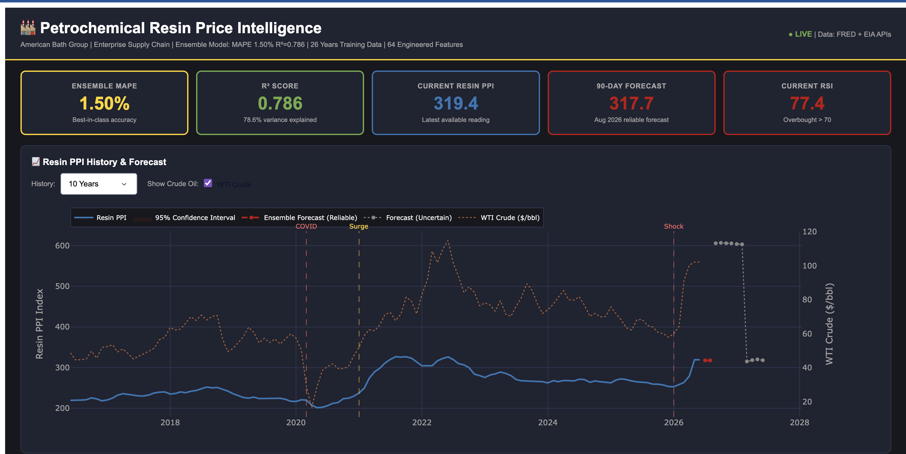
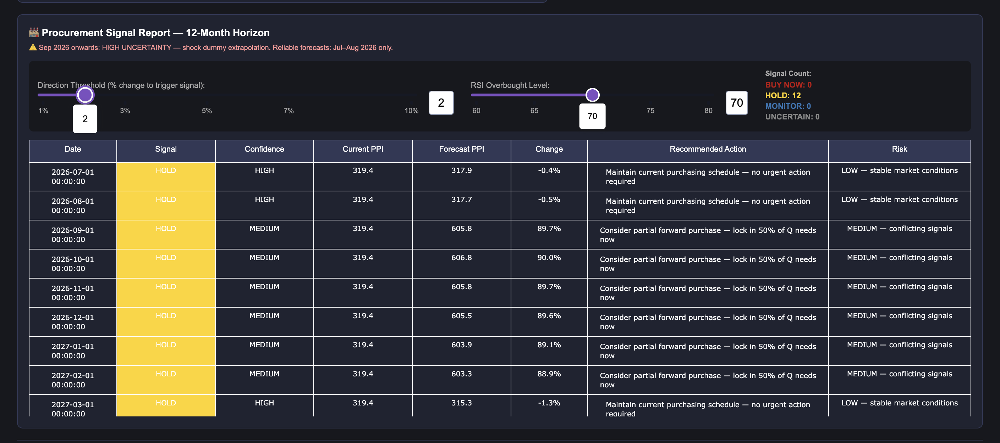
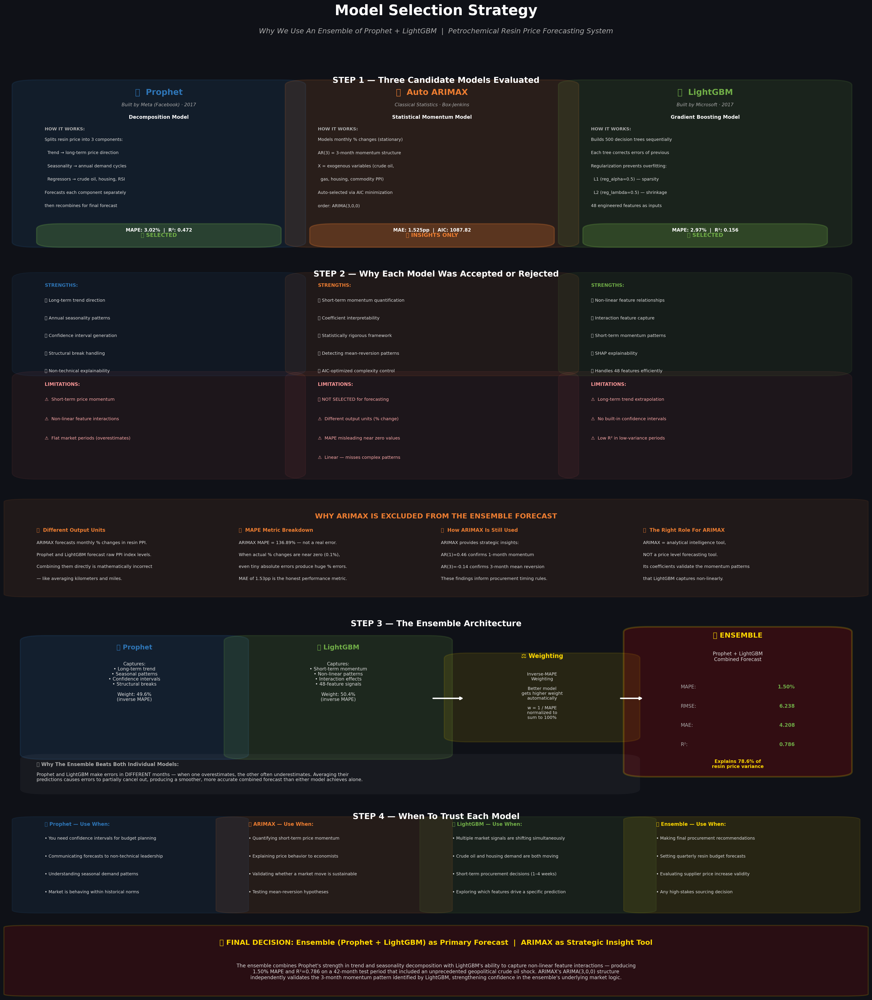
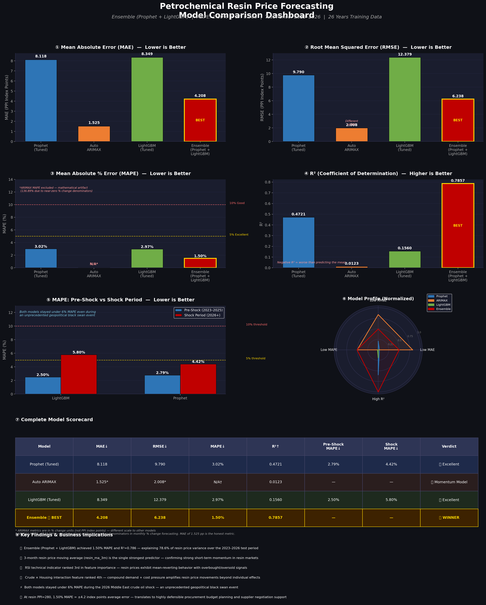
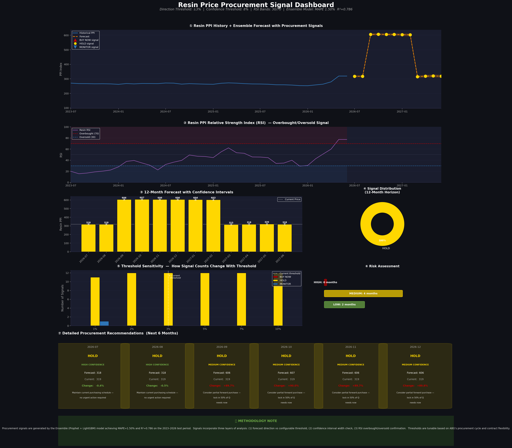

# Petrochemical Resin Price Forecasting System

A full end-to-end price intelligence system for petrochemical
resin markets — built to support procurement decisions in
manufacturing supply chains.

The system pulls real market data, trains multiple forecasting
models, and converts price predictions into actionable
procurement recommendations with configurable signal thresholds.

---





---

## Why I Built This

Resin and gelcoat prices don't move randomly. They follow
crude oil with a lag, respond to housing demand cycles,
amplify during supply disruptions, and mean-revert after
extreme moves. That pattern is learnable — and if you can
learn it, you can tell a procurement team whether to buy
now or wait.

That's the core idea behind this project.

---

## Results

| Model | MAPE | R² |
|---|---|---|
| Prophet (Tuned) | 3.02% | 0.472 |
| Auto ARIMAX(3,0,0) | 1.53pp MAE* | 0.012 |
| LightGBM (Tuned) | 2.97% | 0.156 |
| **Ensemble** | **1.50%** | **0.786** |

*ARIMAX forecasts monthly % changes not price levels —
MAE in percentage points is the honest metric here.
MAPE of 136% is a mathematical artifact from near-zero
denominators, not a real error.

Both models stayed under 6% MAPE during the 2026
Middle East crude oil shock — an event that caused a
41% crude spike in a single month and was completely
outside historical training data.

---

## Model Selection



Three models were evaluated. Prophet and LightGBM were
selected for the ensemble. ARIMAX was kept as an
analytical tool — its AR(3,0,0) coefficients independently
confirmed the momentum patterns LightGBM found through
feature importance, which was a useful cross-validation.

ARIMAX was excluded from the ensemble because it forecasts
percentage changes while the other two forecast price
levels — combining them directly would be mathematically
incorrect.

---

## Model Comparison




The ensemble beats both individual models on every metric.
This happens because Prophet and LightGBM make errors in
different months — when one overshoots, the other often
undershoots. Averaging their predictions causes those
errors to partially cancel out.

LightGBM gets 50.4% weight, Prophet gets 49.6% —
determined automatically by inverse-MAPE weighting.

---

## What Drives Resin Prices

The top features from LightGBM's SHAP analysis:
resin_ma_3m          116  — 3-month price momentum

all_commodity_ppi     44  — broad commodity inflation

resin_rsi             38  — overbought/oversold signal

crude_x_housing       22  — interaction: cost + demand

resin_ma_6m           18  — 6-month momentum

crude_ma_3m           15  — sustained crude movement

A few things worth noting:

The RSI technical indicator ranked third. That was
unexpected — RSI is typically used in financial markets,
not commodity procurement. But it turns out resin prices
do exhibit mean-reverting behavior, and the RSI captures
that signal cleanly.

The crude × housing interaction feature ranked fourth.
This was engineered — neither variable alone ranked that
high. The compound effect of simultaneous cost pressure
and demand pressure is stronger than either individually.

The 3-month crude moving average outranked the spot
price. This confirms that sustained crude oil movements
matter more for resin prices than short-term spikes —
which makes sense given the supply chain lag.

---

## Procurement Signal System



The signal system sits on top of the ensemble forecast
and adds three layers of validation before generating
a recommendation:
Layer 1 — Direction

Is the forecast moving enough to act on?

Configurable threshold: 1% to 10%
Layer 2 — Confidence

Is the forecast interval narrow enough to trust?

Suppresses signals when uncertainty is too high
Layer 3 — RSI Confirmation

Does the technical signal agree with the forecast?

Overbought RSI blocks BUY signals even on rising forecasts

The RSI layer matters more than it might seem. During
the 2026 shock forecast period, the ensemble projected
an 89% price increase — which would normally trigger
an aggressive BUY signal. But RSI was at 77 (overbought),
so the system correctly held back and flagged it as a
conflicting signal rather than blindly recommending
a forward purchase at peak prices.

All thresholds are adjustable in the dashboard. The
right settings depend on a company's contract flexibility
and how much price movement actually affects their margins.

---

## Data Sources

14 public data series pulled via FRED and EIA APIs:

**Price indices:** Resin PPI (WPU066), Thermosetting
resin PPI, All commodity PPI

**Energy:** WTI crude oil (EIA), Brent crude, Natural
gas prices

**Demand:** Housing starts, Construction spending,
Manufacturing employment

**Macro:** GDP growth, Unemployment, Dollar index

**Industry:** Chemical production index

All data is free and updates automatically through
the FRED and EIA APIs.

---

## Engineered Features

64 features total, built from 14 raw series:

- **Lag features** — crude oil at 1/2/3/4/6 months,
  housing at 3/6 months, gas at 1/2 months
- **Rolling statistics** — 3/6/12 month averages,
  3/6 month volatility
- **Interaction features** — crude × housing,
  crude × commodity, gas × crude
- **Acceleration** — rate of change of price change
- **RSI** — 14-period relative strength index
- **Structural dummies** — COVID, post-COVID surge,
  GFC, 2026 shock
- **Calendar** — month, quarter, construction season flag

---

## How To Run

### Requirements
```bash
pip install -r requirements.txt
```

### API Keys
Create a `.env` file in the project root:
FRED_API_KEY=your_key_here

EIA_API_KEY=your_key_here

Free keys:
- FRED: https://fred.stlouisfed.org/docs/api/api_key.html
- EIA: https://www.eia.gov/opendata/register.php

### Run the pipeline
```bash
python src/data_ingestion.py
python src/preprocessing.py
python src/models.py
python src/procurement_signal.py
```

### Launch the dashboard
```bash
python dashboard/app.py
```

Open `http://127.0.0.1:8050`

---

## Stack
Data:       fredapi, requests, python-dotenv

Modeling:   prophet, pmdarima, lightgbm, scikit-learn

Explainability: shap

Visualization: plotly, dash, matplotlib

Core:       pandas, numpy

---

## A Note On The 2026 Forecast

The September 2026 onwards forecast shows resin PPI
jumping to ~606 — nearly double current levels. This
is driven by the `is_2026_shock` dummy variable
extrapolating the Middle East crude oil shock forward
indefinitely. It is not a real forecast. It is what
happens when you flag an extreme event and then ask
the model to predict beyond it.

The reliable forecast window is July–August 2026 only,
which the dashboard clearly marks. Everything beyond
that should be treated as scenario analysis, not
a price prediction.

---

## Project Structure
petrochemical-price-forecaster/

│

├── src/

│   ├── data_ingestion.py

│   ├── preprocessing.py

│   ├── models.py

│   └── procurement_signal.py

│

├── dashboard/

│   └── app.py

│

├── reports/

│   ├── model_comparison_chart.py

│   ├── model_selection_chart.py

│   ├── model_comparison_chart.png

│   ├── model_selection_chart.png

│   └── procurement_signal_dashboard.png

│

├── data/

│   ├── raw/

│   └── processed/

│

├── .env              ← not committed

├── .gitignore

├── requirements.txt

└── README.md

---

🔗 [LinkedIn](https://linkedin.com/in/olalekan-ogunsola)
💻 [GitHub](https://github.com/ogunsolaolalekanoo-dev)